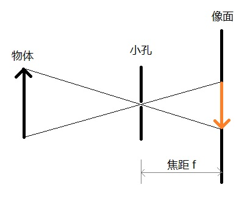
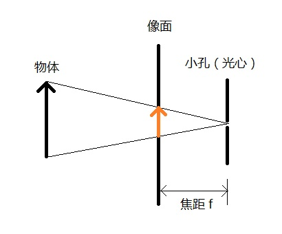
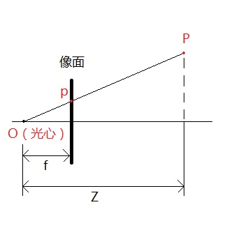
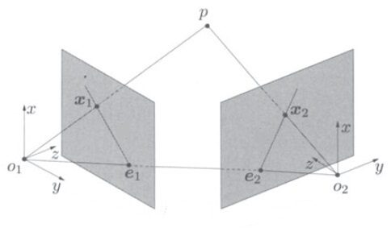

# 特征提取(Feature Exactor) 1

## SFM 基本原理
SFM（structure-from-motion）算法是一种基于各种收集到的图片进行三维重建的离线算法。顾名思义是从运动中（不同时间拍摄的图片集）恢复物体的三维结构，这需要估计出图片代表相机的旋转变换R、平移变换T，结合相机内参重建稀疏点云。

* ### 相机模型
在计算机视觉中，最常用的相机模型就是小孔模型（小孔成像模型），它将相机的透镜组简化为一个小孔，光线透过小孔在小孔后方的像面上成像，如下图所示。

由上图可知，小孔模型成的是倒像，为了表述与研究的方便，我们常常将像面至于小孔之前，且到小孔的距离仍然是焦距f，这样的模型与原来的小孔模型是等价的，只不过成的是正像，符合人的直观感受。在这种情况下，往往将小孔称作光心(Optical Center)。

小孔模型是一种理想相机模型，没有考虑实际相机中存在的场曲、畸变等问题。在实际使用时，这些问题可以通过在标定的过程中引入畸变参数解决，所以小孔模型仍然是目前最广泛使用的相机模型。

* ### 坐标系

为了能用数学解释SFM，我们需要坐标系。在SfM中主要有两类坐标系，一类为相机坐标系，一类为世界坐标系。所有坐标系均为右手坐标系。

* **世界坐标系**
世界坐标系的原点可以任意选择，与相机的具体位置无关。  
* **相机坐标系**
相机坐标系以相机的光心（小孔）作为原点，X轴为水平方向，Y轴为竖直方向，Z轴指向相机所观察的方向。
* **图像物理坐标系**
其原点为透镜光轴与成像平面的交点，x与y轴分别平行于摄像机坐标系的X与Y轴，是平面直角坐标系，单位为毫米。
* **图像素坐标系**
固定在图像上的以像素为单位的平面直角坐标系，其原点位于图像左上角,x与y轴平行于图像物理坐标系的X 和Y轴。对于数字图像，分别为行列方向

* ### 相机内参矩阵
设空间中有一点P，若世界坐标系与相机坐标系重合，则该点在空间中的坐标为(X, Y, Z)，其中Z为该点到相机光心的垂直距离。设该点在像面上的像为点p，像素坐标为(x, y)，如下图所示。

根据相似三角形，可以得到：

$$x=\frac{f X}{Z}, \quad y=\frac{f Y}{Z}$$

但是，图像的像素坐标系原点在左上角，而上面公式假定原点在图像中心，为了处理这一偏移，设光心在图像上对应的像素坐标为$\left(c_{x}, c_{y}\right)$，则

$$x=\frac{f X}{Z}+c_{x}, \quad y=\frac{f Y}{Z}+c_{y}$$

以上关系以矩阵的形式表示，有

$$Z\left[\begin{array}{l}
x \\
y \\
1
\end{array}\right]=\left[\begin{array}{lll}
f & 0 & c_{x} \\
0 & f & c_{y} \\
0 & 0 & 1
\end{array}\right]\left[\begin{array}{l}
X \\
Y \\
Z
\end{array}\right]$$

其中，将矩阵
$$K=\left[\begin{array}{lll}
f & 0 & c_{x} \\
0 & f & c_{y} \\
0 & 0 & 1
\end{array}\right]$$

K 称为内参矩阵，因为它只和相机自身的内部参数有关（焦距，光心位置）。

* ### 相机外参矩阵
一般情况下，世界坐标系和相机坐标系不重合，这时，世界坐标系中的某一点P要投影到像面上时，先要将该点的坐标转换到相机坐标系下。设P在世界坐标系中的坐标为X，P到光心的垂直距离为s（即上文中的Z），在像面上的坐标为x，世界坐标系与相机坐标系之间的相对旋转为矩阵R（R是一个三行三列的旋转矩阵），相对位移为向量T（三行一列），则

$$s x=K[R X+T]$$

其中$R X+T$ 即为P在相机坐标系下的坐标，使用齐次坐标改写上式，有

$$s x=K\left[\begin{array}{ll}
R & T
\end{array}\right]\left[\begin{array}{l}
X \\
1
\end{array}\right]$$

其中$\left[\begin{array}{ll}R & T\end{array}\right]$是一个三行四列的矩阵，称为外参矩阵，它和相机的参数无关，只与相机在世界坐标系中的位置有关。

* ### 相机的标定
相机的标定，即为通过某个已知的目标，求取相机内参矩阵的过程。

* ### 极线约束与本征矩阵
在三维重建前，我们先研究一下同一点在两个相机中的像的关系。假设在世界坐标系中有一点p，坐标为X，它在1相机中的像为x1，在2相机中的像为x2（注意x1和x2为齐次坐标，最后一个元素是1），如下图

设X到两个相机像面的垂直距离分别为s1和s2，且这两个相机具有相同的内参矩阵K，与世界坐标系之间的变换关系分别为[R1  T1]和[R2  T2]，那么我们可以得到下面两个等式
$$\begin{array}{l}
s_{1} x_{1}=K\left(R_{1} X+T_{1}\right) \\
s_{2} x_{2}=K\left(R_{2} X+T_{2}\right)
\end{array}$$

由于K是可逆矩阵，两式坐乘K的逆，有
$$\begin{array}{l}
s_{1} K^{-1} x_{1}=R_{1} X+T_{1} \\
s_{2} K^{-1} x_{2}=R_{2} X+T_{2}
\end{array}$$

设$K^{-1} x_{1}=x_{1}^{\prime}, \quad K^{-1} x_{2}=x_{2}^{\prime}$, 则有
$$\begin{array}{l}
s_{1} x_{1}^{\prime}=R_{1} X+T_{1} \\
s_{2} x_{2}^{\prime}=R_{2} X+T_{2}
\end{array}$$

我们一般称$x_{1}^{\prime}$和$x_{2}^{\prime}$为归一化后的像坐标，它们和图像的大小没有关系，且原点位于图像中心。
由于世界坐标系可以任意选择，我们将世界坐标系选为第一个相机的相机坐标系，这时$R_{1}=I, T_{1}=0$。上式则变为
$$\begin{array}{c}
s_{1} x_{1}^{\prime}=X \\
s_{2} x_{2}^{\prime}=R_{2} X+T_{2}
\end{array}$$

将式一带入式二，则
$$s_{2} x_{2}^{\prime}=s_{1} R_{2} x_{1}^{\prime}+T_{2}$$

$x_{2}^{\prime}$ 和 $T_{2}$ 都是三维向量, 它们做叉积之后得到另外一个三维向量 $T_{2} x_{2},$ (其中 $\hat{T}_{2}$ 为叉积的矩阵形式, $\quad \hat{T}_{2} x_{2}^{\prime}$ 代表 $\hat{T}_{2} \times$ $x_{2}^{\prime}$ )，且该向量垂直于 $x_{2}^{\prime}$ 和 $T_{2}$, 再用该向量对等式两边做点积, 则
$$\begin{aligned}
0 &=s_{1}\left(\hat{T}_{2} x_{2}^{\prime}\right)^{T} R_{2} x_{1}^{\prime} \\
& \Rightarrow x_{2}^{\prime} \hat{T}_{2} R_{2} x_{1}^{\prime}=0
\end{aligned}$$

令$E=\hat{T}_{2} R_{2}$，则
$$\begin{array}{c}
x_{2}^{\prime} E x_{1}^{\prime}=0 \\
\Rightarrow x_{2}^{T} K^{-T} S_{t 2} R_{2} K^{-1} x_{1}=0 \\
\text { 其中 } F=K^{-T} S_{t 2} R_{2} K^{-1}
\end{array}$$

这里S $_{t 2}$ 为反对称矩阵
$$S_{t 2}=\left[\begin{array}{ccc}
0 & -t_{3} & t_{2} \\
t_{3} & 0 & -t_{1} \\
-t_{2} & t_{1} & 0
\end{array}\right]$$

上式是同一点在两个相机中的像所满足的关系，它和点的空间坐标、点到相机的距离均没有关系，我们称之为极线约 東(外极约束)。而矩阵E则称为关于这两个相机的本质矩阵（基础矩阵F）。如果我们知道两幅图像中的多个对应点 (至少5对)，则可以通过上式解出矩阵E, 又由于F是由 $T_{2}$ 和 $R_{2}$ 构成的, 可以从F中分解出 $T_{2}$ 和 $R_{2}$ 。由于 det(F)=0, 所以基础矩阵的秩小于等于2，在估计的算法中会用到这些性质。

## SFM 算法总体流程
* ### 特征点提取
    * **Shi&Tomasi**
    * **SIFT**
    * **SURF**

* ### 特征点匹配
    * **特征描述符计算**
    匹配结果往往有很多误匹配，为了排除这些错误，使用KNN算法寻找与该特征最匹配的2个特征，若第一个特征的匹配距离与第二个特征的匹配距离之比小于某一阈值，就接受该匹配，否则视为误匹配。当然，也可以使用交叉验证方法来排除错误

* ### 基本矩阵F估计
    基础矩阵中有9 个元素

    * **5点法**
    * **8点法**
        采用了RANSAC的方法进行对本征矩阵E进行估计，每一步迭代的过程中，利用8点法进行求解。

* ### 本征矩阵E估计
    本征矩阵有7个独立参数
    估计出本质矩阵的目的是为了对之前求得的匹配进行约束，得到的匹配成为几何一致匹配，不同图像上的几何一致匹配形成了一个特征TRACK（其实就是一个空间点在不同的图像上的投影点之间的匹配）

* ### 本征矩阵分解R、T
    * **SVD分解**
    * **存在4种可能的解**
    * **检查旋转矩阵R的正确性**
    R 的行列式必须为 1 或者 -1

* ### 稀疏点云计算
    * **三角测量法**
    已经知道了两个相机之间的变换矩阵(R和T)，还有每一对匹配点的坐标，通过这些已知信息还原匹配点在空间当中的坐标，根据公式   
    $$x_{2} s_{2}=K\left(R_{2} X+T_{2}\right)$$
    这个等式中有两个未知量, 分别是 $s_{2}, x$。用s 2 对等式两边做叉积, 可以消去 $s_{2}$， 得
    $$\begin{array}{c}
    0=\hat{x}_{2} K\left(R_{2} X+T_{2}\right) \\
    \Rightarrow \hat{x}_{2} K R_{2} X=-\hat{x}_{2} K T_{2} \\
    \Rightarrow \hat{x}_{2} K\left(R_{2} \quad T_{2}\right)\left(\begin{array}{c}
    X \\
    1
    \end{array}\right)=0
    \end{array}$$
    用SVD求X左边矩阵的零空间，再将最后一个元素归一化到1，即可求得X。其几何意义相当于分别从两个相机的光心作过x1和x2的延长线，延长线的交点即为方程的解，如文章最上方的图所示。

    * **重投影**
        将三维点三角化并重映射到摄像机得到二维点，计算与最初二维点之间的距离，说明三角化误差。
    * **计算第三个摄像机到到世界坐标系的变换矩阵(R和T)**
        * 假设：用于多目重建的图像是有序的，即相邻图像的拍摄位置也是相邻的。
        * 猜想：
            * 最简单的想法，就是沿用双目重建的方法，即在第三幅图像和第一幅图像之间提取特征点，然后估计本征矩阵E。那么加入第四幅、第五幅，乃至更多呢？随着图像数量的增加，新加入的图像与第一幅图像的差异可能越来越大，特征点的提取变得异常困难，这时就不能再沿用双目重建的方法了。
             
            * 用新加入的图像和相邻图像进行特征匹配，然后计算E，但这是计算的是相对变换，比如相机三到相机二的变换，而我们需要的是相机三到相机一的变换。有人说，既然知道相机二到相机一的变换，又知道相机到三到相机二的变换，不就能求出相机三到相机一的变换吗？实际上，通过这种方式，你只能求出相机三到相机一的旋转变换（旋转矩阵R），而他们之间的位移向量T，是无法求出的。这是因为上面两个函数求出的位移向量，都是单位向量，丢失了相机之间位移的比例关系。
         * 算法描述：
            * 摄像机标定或摄像机之态估计，对于输入的第三幅图片，计算第三幅图片与第二幅图片的匹配点，这些匹配点中，肯定有一部分也是图像二与图像一之间的匹配点，也就是说，这些匹配点中有一部分的空间坐标是已知的，同时又知道这些点在第三幅图像中的像素坐标，即可计算变换矩阵
                * 透视N点法（PNP）
            * 三角化更多的点并查看这些点是如何融入存在的几何结构中，然后进行求解。
                * 迭代最近点法（ICP）
    * **更多摄像相机的变换矩阵计算**
        得到第三个摄像机的变换矩阵后，就可以计算匹配点的在空间中的坐标，得到三维点云，将新得到的三维点云与之前计算得三维点云进行融合（已经存在的空间点，就没必要再添加了，只添加在图像二和三之间匹配，但在图像一和图像三中没有匹配的点）。然后循环迭代，如下图所示。
        

    * **重构的细化与优化**
        * 原因：随着图像的不断增加，误差会不断累积，最后误差过大以至于完全偏离重建的目标。
        * 目的：三维点云的位置和摄像机的位置优化
        * 算法：
            * 光束法平差（Bundle Adjustment）
            BA本质上是一个非线性优化算法
                * 简单稀疏光束调整（SSBA）
            * Ceres Solver
            Google的一个开源项目，用来求解非线性最小二次问题的库，因此可以用来求解BA。Ceres Solver专为求解此类问题进行了大量的优化，有很高的效率，尤其在大规模问题上，其优势更加明显。