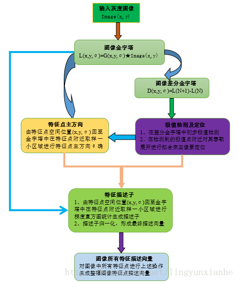
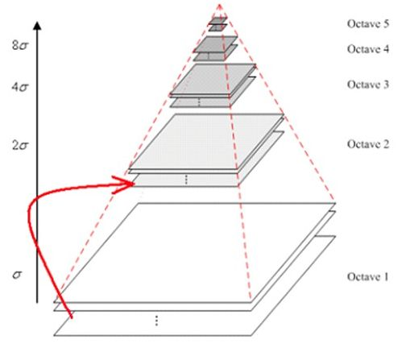
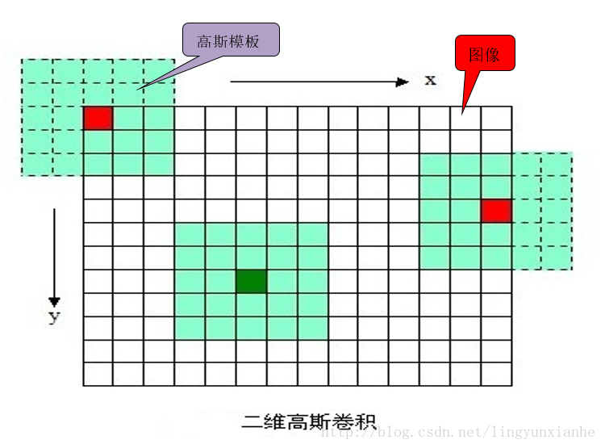
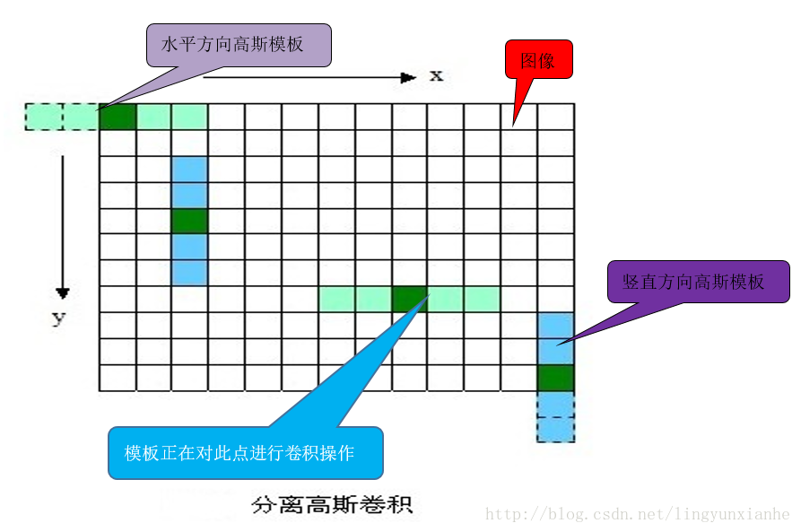
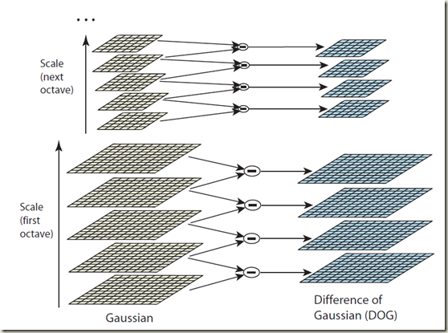
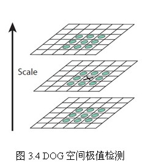
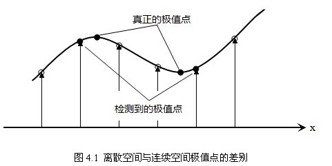

# 特征提取(Feature Exactor) 2

## SIFT 特征点检测

* ### SIFT算法简介
    尺度不变特征转换即SIFT (Scale-invariant feature transform)是一种计算机视觉的算法。它用来侦测与描述影像中的局部性特征，它在空间尺度中寻找极值点，并提取出其位置、尺度、旋转不变量，此算法由 David Lowe在1999年所发表，2004年完善总结。
    局部影像特征的描述与侦测可以帮助辨识物体，SIFT特征是基于物体上的一些局部外观的兴趣点而与影像的大小和旋转无关。对于光线、噪声、些微视角改变的容忍度也相当高。基于这些特性，它们是高度显著而且相对容易撷取，在母数庞大的特征数据库中，很容易辨识物体而且鲜有误认。使用 SIFT特征描述对于部分物体遮蔽的侦测率也相当高，甚至只需要3个以上的SIFT物体特征就足以计算出位置与方位。在现今的电脑硬件速度下和小型的特征数据库条件下，辨识速度可接近即时运算。SIFT特征的信息量大，适合在海量数据库中快速准确匹配。
    SIFT算法的实质是在不同的尺度空间上查找关键点(特征点)，并计算出关键点的方向。SIFT所查找到的关键点是一些十分突出，不会因光照，仿射变换和噪音等因素而变化的点，如角点、边缘点、暗区的亮点及亮区的暗点等

    * **哪些是关键点**
    这些点是一些十分突出的点，不会因为光照条件的改变二消失，比如角点、边缘点、暗区域的亮点、亮区域的暗点，既然两幅图像有相同的景物，那么使用某种方法分别提取各自的稳定点，这些点之间会有相互对应的匹配点。
    所谓关键点，就是在不同尺度空间的图像下检测出的具有方向信息的局部极值点。
    根据归纳，特征点具备三个属性: **方向、尺度、大小**

    * **什么是尺度空间**
    一个图像的尺度空间 $\mathrm{L}(\mathrm{x}, \mathrm{y}, \sigma)$ ，定义为原始图像$\mathrm{I}(\mathrm{x}, \mathrm{y})$ 与一个可变尺度的2维高斯函数$\mathrm{G}(\mathrm{x}, \mathrm{y}, \sigma)$ 的卷积运算。
    高斯函数：
        $$\begin{array}{c}
        G\left(x_{i}, y_{i}, \sigma\right)=\frac{1}{2 \pi \sigma^{2}} \exp \left(-\frac{\left(x-x_{i}\right)^{2}+\left(y-y_{i}\right)^{2}}{2 \sigma^{2}}\right)
        \end{array}$$
        $$\begin{array}{c}
        L(x, y, \sigma)=G(x, y, \sigma) * I(x, y)
        \end{array}$$

    * **算法流程**

    

* ### SIFT 算法步骤
    * **图像金字塔**
        * **高斯金字塔**
        图像高斯金字塔(Gaussian Pyramid)是采用高斯函数对图像进行模糊以及降采样处理得到。其形成过程可如下图所示：
        
        我们还可以通过图像的模糊程度来模拟人在距离物体由远到近时物体在视网膜上成像过程，距离物体越近其尺寸越大图像也越模糊，这就是高斯尺度空间，使用不同的参数模糊图像（分辨率不变），是尺度空间的另一种表现形式。
        我们知道图像和高斯函数进行卷积运算能够对图像进行模糊，使用不同的“高斯核”可得到不同模糊程度的图像。一副图像其高斯尺度空间可由其和不同的高斯卷积得到：
        $$L(x,y,\sigma) = G(x,y,\sigma) * I(x,y)$$
        其中$G(x,y,\sigma)$是高斯核函数。
        $$G(x,y,\sigma) = \frac{1}{2 \pi \sigma ^2} e ^ {\frac{x^2 +y^2}{2 \sigma^2}}$$
        $\sigma$称为尺度空间因子，它是高斯正态分布的标准差，反映了图像被模糊的程度，其值越大图像越模糊，对应的尺度也就越大。$L(x, y, \sigma)$代表着图像的高斯尺度空间。
        构建尺度空间的目的是为了检测出在不同的尺度下都存在的特征点，而检测特征点较好的算子是$\Delta^2G$(高斯拉普拉斯, $LoG$）,
        $$\Delta ^2 = \frac{\partial ^2}{\partial x^2} + \frac{\partial ^2}{\partial y^2}$$

        * **高斯函数与图像卷积**
        使用N x N的模板在图像每一个像素点处操作，其中$\mathrm{N}=[(6 \sigma+1)]$且向上取最邻近奇数。
        

        * **高斯分离卷积**
        上面这样直接与图像卷积，速度比较慢，同时图像边缘信息也会损失严重。后来，后来，不知哪位学者发现，可以使用分离的高斯卷积（即先用1xN的模板沿着X方向对图像卷积一次，然后用Nx1的模板沿着Y方向对图像再卷积一次，其中$\mathrm{N}=[(6 \sigma+1)]$且向上取最邻近奇数），这样既省时也减小了直接卷积对图像边缘信息的严重损失。
        

    * **高斯差分金字塔**
    2002年Mikolajczyk在详细的实验比较中发现尺度归一化的高斯拉普拉斯函数的极大值和极小值同其它的特征提取函数，例如：梯度，Hessian或Harris角特征比较，能够产生最稳定的图像特征。而Lindeberg早在1994年就发现高斯差分函数（简称DOG算子）与尺度归一化的高斯拉普拉斯函数非常近似。如下式：
    $$\mathrm{G}(x, y, k\sigma) - \mathrm{G}(x,y,\sigma) \approx (k-1)\sigma^2\nabla^2G$$
    其中k-1是个常数，并不影响极值点位置的求取
    结合上面的高斯拉普拉斯算子：
    $$\nabla ^2G = \frac{\partial ^2G}{\partial x^2} + \frac{\partial ^2G}{\partial y^2}$$
    尺度规范化的$LoG$算子：
    $$\sigma^2\nabla^2G$$
        * **差分金子塔的建立**
        差分金字塔的是在高斯金字塔的基础上操作的，其建立过程是：在高斯金子塔中的每组中相邻两层相减（下一层减上一层）就生成高斯差分金字塔.
        高斯差分金字塔其操作如下图：
        
        $DoG$算子只需相邻尺度高斯平滑后图像相减，因此简化了计算！
        $DoG$算子：
        $$\mathrm{D}(x, y, \sigma) = \left[\mathrm{G}(x, y, k\sigma)-\mathrm{G}(x, y, \sigma) \right] * \mathrm{I}(x, y) = \mathrm{L}(x, y, k\sigma) - \mathrm{L}(x, y, \sigma)$$

    * **空间极值点(即关键点)的检测**
        关键点是由DOG空间的局部极值点组成的，关键点的初步探查是通过同一组内各DoG相邻两层图像之间比较完成的。为了寻找DoG函数的极值点，每一个像素点要和它所有的相邻点比较，看其是否比它的图像域和尺度域的相邻点大或者小。如图下图所示，中间的检测点和它同尺度的8个相邻点和上下相邻尺度对应的9×2个点共26个点比较，以确保在尺度空间和二维图像空间都检测到极值点。

        * **极值点检测过程**
        由于要在相邻尺度进行比较，如上图右侧每组含4层的高斯差分金子塔，只能在中间两层中进行两个尺度的极值点检测，其它尺度则只能在不同组中进行。为了在每组中检测S个尺度的极值点，则DOG金字塔每组需S+2层图像，而DOG金字塔由高斯金字塔每组中相邻两层相减得到，则高斯金字塔每组需S+3层图像，实际计算时S在3到5之间。
        当然这样产生的极值点并不全都是稳定的特征点，因为某些极值点响应较弱，而且DOG算子会产生较强的边缘响应。
        

        * **关键点定位**
        以上方法检测到的极值点是离散空间的极值点，以下通过拟合三维二次函数来精确确定关键点的位置和尺度，同时去除低对比度的关键点和不稳定的边缘响应点(因为DoG算子会产生较强的边缘响应)，以增强匹配稳定性、提高抗噪声能力。
        离散空间的极值点并不是真正的极值点，下图显示了二维函数离散空间得到的极值点与连续空间极值点的差别。利用已知的离散空间点插值得到的连续空间极值点的方法叫做子像素插值。
        
        为了提高关键点的稳定性，需要对尺度空间DoG函数进行曲线拟合。利用DoG函数在尺度空间的Taylor展开式(拟合函数)为：
        $$
        D(X)=D+\frac{\partial D^{T}}{\partial X} X+\frac{1}{2} X^{T} \frac{\partial^{2} D}{\partial X^{2}} X
        $$
        其中，$\mathrm{X}=(x, y, \sigma) ^{T}$。求导并让方程等于零，可以得到极值点的偏移量为：
        $$
        \hat{X}=-\frac{\partial^{2} D^{-1}}{\partial X^{2}} \frac{\partial D}{\partial X}
        $$
        对应极值点，方程的值为：
        $$
        D(\hat{X}) = D + \frac{1}{2} \frac{\partial D^{T}}{\partial X} \hat{X}
        $$
        其中, $\hat{X}=(x, y, \sigma) ^{T}$代表相对插值中心的偏移量，当它在任一维度上的偏移量大于0.5时，意味着插值中心已经偏移到它的邻近点上，所以必须改变当前关键点的位置。同时在新的位置上反复插值直到收敛；也有可能超出所设定的迭代次数或者超出图像边界的范围，此时这样的点应该删除。

        * **消除边缘响应**
        一个定义不好的高斯差分算子的极值在横跨边缘的地方有较大的主曲率，而在垂直边缘的方向有较小的主曲率。DOG算子会产生较强的边缘响应，需要剔除不稳定的边缘响应点。获取特征点处的Hessian矩阵，主曲率通过一个2x2 的Hessian矩阵H求出：
        $$
        H = \left[\begin{array}{ll}
        D_{xx} & D_{xy} \\
        D_{xy} & D_{yy} \\
        \end{array}\right]$$

        

    
    * **关键点方向分配**
    为了使描述符具有旋转不变性，需要利用图像的局部特征为给每一个关键点分配一个基准方向。使用图像梯度的方法求取局部结构的稳定方向。
        * **特征点的梯度**
        对于在DOG金字塔中检测出的关键点点，采集其所在高斯金字塔图像3σ领域窗口内像素的梯度和方向分布特征。梯度的模值和方向如下:
        $$
        \begin{array}{l}
        m(x, y)=\sqrt{(L(x+1, y)-L(x-1, y))^{2}+(L(x, y+1)-L(x, y-1))^{2}} \\
        \left.\theta(x, y)=\tan ^{-1}((L(x, y+1)-L(x, y-1)) / L(x+1, y)-L(x-1, y))\right)
        \end{array}
        $$

        $L$为关键点所在的尺度空间值，按作者的建议，梯度的模值$m(x,y)$的高斯分布加成，按σ=1.5σ_oct尺度采样的$3\sigma$原则，邻域窗口半径为3x1.5σ_oct。

        在完成关键点的梯度计算后，使用直方图统计邻域内像素的梯度和方向。梯度直方图将0~360度的方向范围分为36个柱(bins)，其中每柱10度。如图所示，直方图的峰值方向代表了关键点的主方向，(为简化，图中只画了八个方向的直方图)。

        

        方向直方图的峰值则代表了该特征点处邻域梯度的方向，以直方图中最大值作为该关键点的主方向。为了增强匹配的鲁棒性，只保留峰值大于主方向峰值80％的方向作为该关键点的辅方向。因此，对于同一梯度值的多个峰值的关键点位置，在相同位置和尺度将会有多个关键点被创建但方向不同。仅有15％的关键点被赋予多个方向，但可以明显的提高关键点匹配的稳定性。实际编程实现中，就是把该关键点复制成多份关键点，并将方向值分别赋给这些复制后的关键点，并且，离散的梯度方向直方图要进行插值拟合处理，来求得更精确的方向角度值，检测结果如下图所示：

        
    
    * **关键点特征描述子**
    通过以上步骤，对于每一个关键点，拥有三个信息：位置、尺度以及方向。接下来就是为每个关键点建立一个描述符，用一组向量将这个关键点描述出来，使其不随各种变化而改变，比如光照变化、视角变化等等。这个描述子不但包括关键点，也包含关键点周围对其有贡献的像素点，并且描述符应该有较高的独特性，以便于提高特征点正确匹配的概率。
        * **特征生成过程**
        将关键点附近的区域划分为d*d(作者建议d=4)个子区域，每个子区域作为一个种子点，每个种子点有8个方向。考虑到实际计算时，需要采用三线性插值，所需图像窗口边长为3x3xσ_oct x(d+1)  。在考虑到旋转因素(方便下一步将坐标轴旋转到关键点的方向)，如下图6.1所示，实际计算所需的图像区域半径为：
        $$
        \text {radius}=\frac{3 \sigma_{-} \operatorname{oct} \times \sqrt{2} \times(d+1)}{2}
        $$

        

        将坐标轴旋转为关键点的方向，以确保旋转不变性，如图所示
        

        旋转后邻域内采样点的新坐标为：
        $
        \left(\begin{array}{l}x^{\prime} \\ y^{\prime}\end{array}\right)=\left(\begin{array}{cc}\cos \theta & -\sin \theta \\ \sin \theta & \cos \theta\end{array}\right)\left(\begin{array}{l}x \\ y\end{array}\right)(x, y \in[-$radius$,$radius$])
        $

        将邻域内的采样点分配到对应的子区域内，将子区域内的梯度值分配到8个方向上，计算其权值。
        旋转后的采样点坐标在半径为radius的圆内被分配到 d xd 的子区域, 计算影响子区域的采样点的梯度和方向，分配到8个方 向上。旋转后的采样点 $\left(x^{\prime}, y^{\prime}\right)$落在子区域的下标为
        $\left(\begin{array}{l}x^{m} \\ y^{\prime \prime}\end{array}\right)=\frac{1}{3 \sigma_{-} \operatorname{oct}}\left(\begin{array}{l}x^{\prime} \\ y^{\prime}\end{array}\right)+\frac{d}{2}$

        作者建议子区域的像素的梯度大小按 0.5d 的高斯加权计算, 即
        $$w=m(a+x, b+y) * e^{-\frac{\left(x^{\prime}\right)^{2}+\left(y^{\prime}\right)^{2}}{2 \times(0.5 d)^{2}}}$$
        其中a，b为关键点在高斯金字塔图像中的位置坐标。

        