# 特征提取(Feature Exactor) 3

该章节详细介绍SIFT算法的流程

## SIFT 尺度不变特征变换

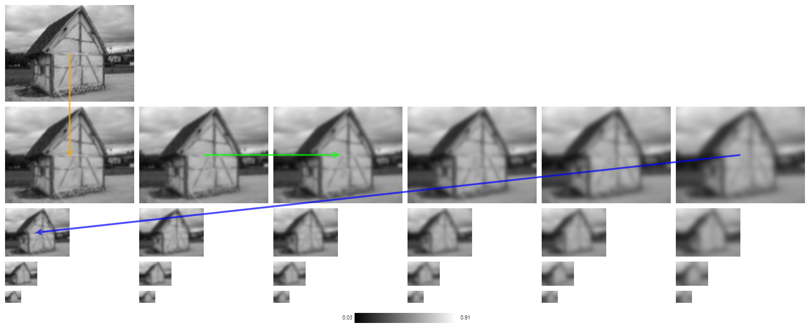

1. 该算法首先使用**bilinear interpolation**将输入的宽度和高度加倍。那是上面的第一张照片，是它自己的一行。

2. 随后使用高斯卷积对这张图片进行模糊处理。这由橙色箭头指示。

3. 接下来是随着标准偏差增加而进一步卷积的序列。如右箭头所示，最右边的每张图片都是对其左邻居进行卷积的结果。

4. 最后，每行末尾的图片将进行降采样-请参见蓝色箭头。这开始了另一次卷积。我们重复此过程，直到图片太小无法继续。（顺便说一句，每行通常称为一个八度**octive**，因为采样率每级降低了两倍。）

我们现在构造的被称为尺度空间。这样做的目的是模拟不同尺度的观察（往下）并抑制精细尺度的结构（往右）。

请注意，上面的表示形式已经过归一化-请参见其底部的灰色图表。对于低对比度图像，这尤其明显。（具有完全对比度的输入的黑色为0.00，白色为1.00。）

现在进行下一步。让我们假设片刻空间的每个八度是一个连续的空间，具有三个维度：像素的x和y坐标以及卷积的标准差。在理想的情况下，我们现在要计算尺度空间函数的拉普拉斯算子，该函数将灰度值分配给该空间的每个元素。拉普拉斯算式的极值将成为我们算法正在寻找的关键点的候选者。但是，由于我们必须在这个连续空间的离散近似中进行工作，因此，我们将改用一种称为高斯差分的技术。

对于上表中的每对水平相邻图片，我们计算各个像素的差异。

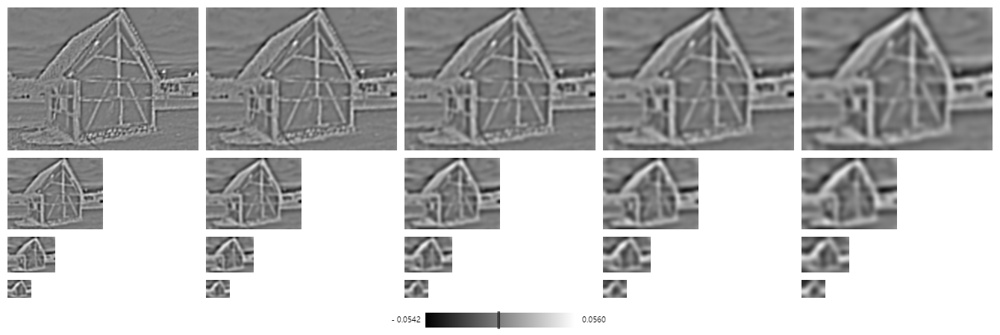

如果你点击上面的一个像素，你会在下面看到这个单个像素的差值是如何计算的。你会看到中间的差值图像的剪裁，而在左边和右边你会看到被减去的两个尺度空间图像的相应剪裁。请注意，差异图像中的亮点意味着亮度增加，而暗点则意味着相反。中等灰色（见上面灰度图中的标记）表示没有变化。

（顺便说一下，所有的差异通常都比较小。如果差异图像没有被归一化，我们会看到大部分或只有中灰色。）

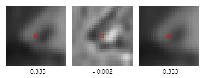

这些差值图像的离散极值现在将是我们上面谈到的实际极值的良好近似。在我们的例子中，离散最大值是指一个像素的灰度值大于其所有26个相邻像素的灰度值；当然，离散最小值也是以类似的方式定义的。在这里，我们把同一张图片中相邻的8个像素，同八度中相邻图片中相应的2个像素，最后把它们在同一张图片中的邻居算作“邻居”。

我们找到的极值标示在下面。（有些用黄圈标出。这些确实是极值，但它们的绝对值太小了，所以我们在继续进行操作之前将其舍弃。该算法假设这些极值很可能只是由于图像噪声而存在。）

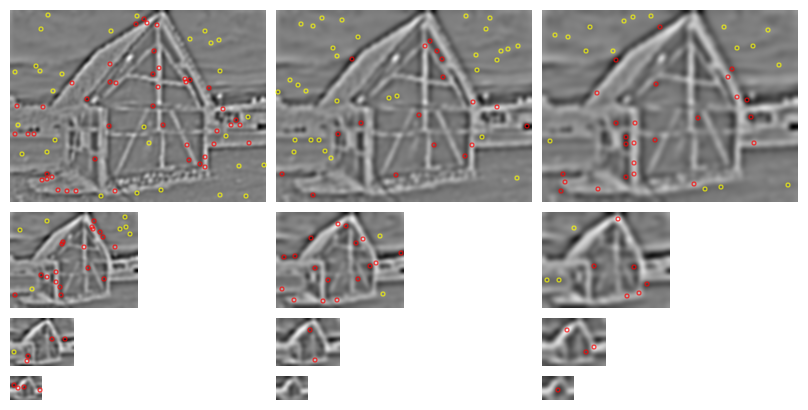

你可以单击上方的每个极值，以查看下面呈现的像素及其26个邻居。（请注意，显示的值当然是四舍五入的，因此，一些相邻的值可能看起来与极值相同，尽管实际上并非如此。）

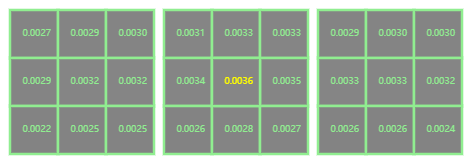
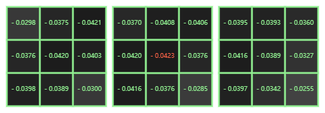

到目前为止，我们发现的极值将具有离散坐标。现在，我们尝试完善这些坐标。通过近似尺度空间函数的二次[泰勒展开](https://en.wikipedia.org/wiki/Taylor_series)并计算其极值来完成（对于每个极值）。（使用[有限差分](https://en.wikipedia.org/wiki/Finite_difference)来近似[渐变](https://en.wikipedia.org/wiki/Gradient)和[Hessian](https://en.wikipedia.org/wiki/Hessian_matrix)。）这是一个迭代过程，我们要么可以精确定位，要么经过两步就放弃并放弃了该点。

现在我们有了更好的（“连续”）坐标，我们还要做更多的事情。我们尝试识别（并丢弃）位于边缘的候选关键点。这些不是关键点，因为它们对于平行于边缘方向的平移始终不变。通过比较比例空间函数在相应位置的[主曲率](https://en.wikipedia.org/wiki/Principal_curvature)（或更确切地说，其投影到图片平面上），可以找到边缘极值。（这是借助 Hessian的[迹](https://en.wikipedia.org/wiki/Trace_%28linear_algebra%29)和[行列式](https://en.wikipedia.org/wiki/Determinant)完成的，但是我们在这里不讨论详细信息。）

其余关键点如下所示。（由于我们现在对它们的位置有了更好的估计，所以我们也可以丢弃一些低对比度的点。这些点再次用黄色标记。）

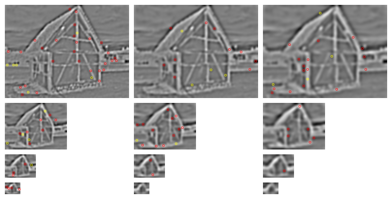

您可以单击上面的关键点，在下表中查看如何完善其比例空间坐标。

|          | 离散的|  内插 |
|:--------:|:-----:|------:|
|    X     | 38.0  | 37.775|
|    ÿ     | 24.5  | 24.213|
|   规模   | 2     | 2.189 |

您可能会觉得有些“新”点不在上面的极端中。但是这些将是从一个比例图移到另一比例图的点。（例如，如果一个点最初位于中间，即如果其值为2，则细化值现在可以为2.57。这意味着它现在显示在右侧，因为最接近的整数现在为3。 ）

现在，如果可能的话，算法会给每个剩余的关键点分配其参考方向。非常粗略的说，我们观察这样一个点的直接邻域内的所有梯度，看看其中许多梯度是否有大致相同的方向。

（技术细节如下：对于在周围的关键点的方形贴片的每个像素，我们近似[梯度](https://en.wikipedia.org/wiki/Gradient)使用[有限差分](https://en.wikipedia.org/wiki/Finite_difference)。回想一下，在最大增加的方向上的梯度的点，其大小是，斜率在从0到360度的时间间隔被划分为固定数量的bin（默认为36），并且在将梯度方向乘以[高斯权重](https://en.wikipedia.org/wiki/Gaussian_blur)之后，将梯度方向所属的bin的值增加。这样做是为了减少更远的像素的影响，然后通过重复的[框模糊](https://en.wikipedia.org/wiki/Box_blur)对生成的[直方图](https://en.wikipedia.org/wiki/Histogram)（即bin列表）进行平滑处理。最后，如果直方图的值超过某个阈值，则将其识别并选择。然后计算更好的参考方向近似值 ，即直方图极值的[二次插值](https://en.wikipedia.org/wiki/Polynomial_interpolation)和其两个相邻bin中的值的最大值。）

图像边界附近没有足够相邻像素无法计算参考方向的关键点将被丢弃。没有主导方向的关键点也将被丢弃。另一方面，具有多个主导方向的关键点在下一步中可能会出现多次，即每个方向一次。

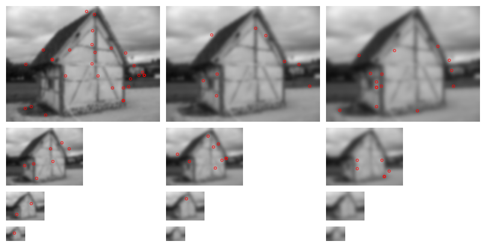

如果单击上面的关键点之一，您将在左下方看到其附近被调查的部分以及计算出的参考方向。在右侧，您将看到从中导出此方向的（平滑和归一化）直方图。

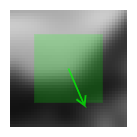
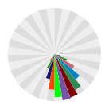

现在，我们有了最后一组关键点（差不多了），并将作为最后一步，为每个关键点计算描述符。

此步骤与上面的步骤非常相似。我们将再次为每个关键点附近的梯度方向分布计算直方图。所不同的是，这一次邻域是一个圆，并且坐标系已旋转以匹配参考方向。同样，完全的事实是我们不仅计算了一个，而且还计算了十六个直方图。每个直方图对应于新坐标系中心附近的一个点，并且根据邻近度，来自圆形邻域内的每个梯度的贡献分布在这些直方图上。

（此外，作为次要的技术细节，如果某些关键点的圆不适合图像，则这些关键点可能会在最后一步被丢弃。）

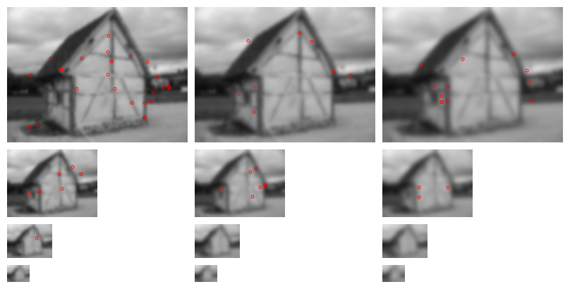

您可以单击上面的关键点，以查看下面用于生成描述符的邻域和坐标系。您还将看到实际描述符的渲染，即直方图（已标准化并在内部表示为4×4×8 = 128个8位整数）的呈现。（就像上面一样，实际上应该想象直方图将被渲染为饼图，因为我们在这里谈论角度。）

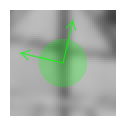
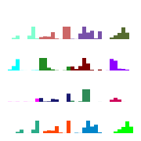

那么，我们现在有什么？我们有大量的描述符。实践经验表明，即使与参考图像相比，这些描述符以不同的光照，从不同的角度或以不同的大小进行描绘，也经常可以用来标识图像中的对象。为什么这样做？原因如下：

* 以不同的比例和模糊级别提取关键点，然后在比例空间框架内执行所有后续计算。这将使描述符对于图像缩放和视角的微小变化是不变的。
* 相对于参考方向的计算应该使描述符对于旋转具有鲁棒性。
* 同样，描述符信息是相对于关键点位置存储的，因此相对于平移是不变的。
* 如果许多潜在的关键点不稳定或难以精确定位，则将其丢弃。因此，其余关键点应相对不受图像噪声的影响。
* 直方图最后进行了归一化，这意味着描述符将不存储梯度的大小，而仅存储它们之间的关系。这应该使描述符对于全局一致的照明变化是不变的。
* 直方图值也经过阈值处理以减少大梯度的影响。这将使信息部分不受照明局部，非均匀变化的影响。